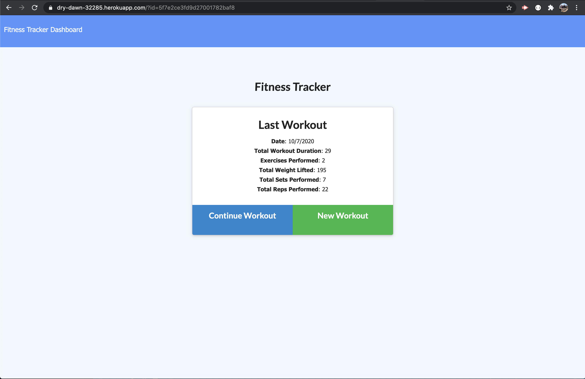
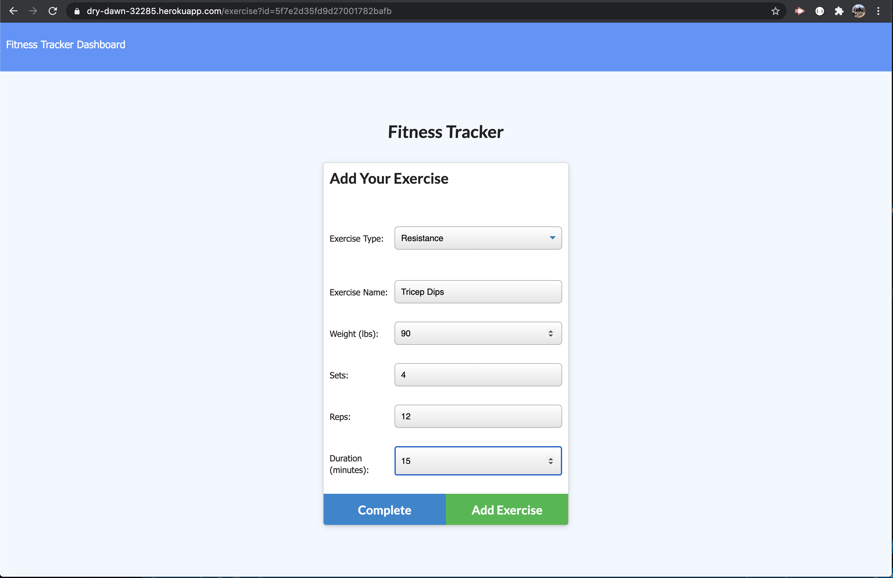
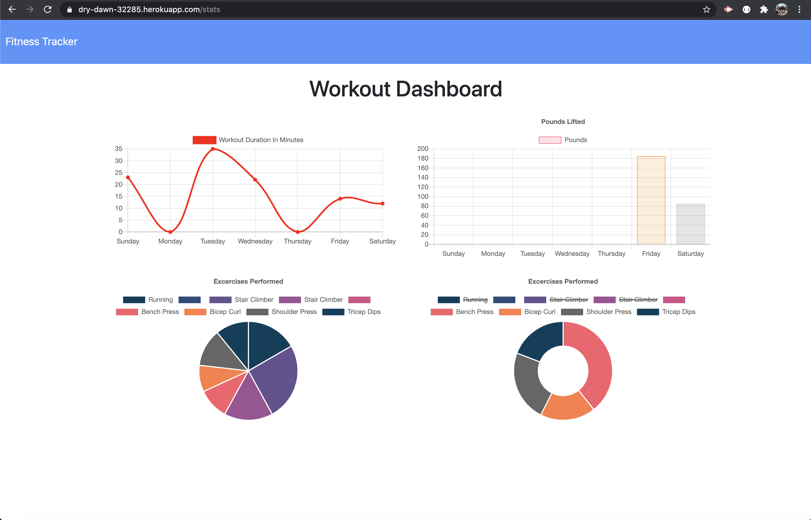

# Note Taker Homework 13   

## Introduction  

This assignment was given to create a workout tracker app that would log multipule excersises in a day of a workout. It would log the name, type, weight, sets, reps, and duration of exercise. For cardio, it would log distance traveled. This assignment used a NoSQL database, MongoDB, as the storage database.

## Table of Contents:  
* [Objectives](#Objectives)
* [Process](#Process)
* [Challenges](#Challenges)
* [Summary](#Summary)
* [Sites](#Sites)
* [Screenshots](#Screenshots)

## Objectives  

```md
When the user loads the page, they should be given the option to create a new workout or continue with their last workout.

The user should be able to:

  * Add exercises to a previous workout plan.

  * Add new exercises to a new workout plan.

  * View the combined weight of multiple exercises on the `stats` page.
```

## Process  

* I first copied the homework into my own repository for the assignment.  
* I then completed npm i installation into my repository.  
* Much of the code was given in the assignment, I was responsible for adding the server.js, routing, seeding, and model pages. I was also responsible for setting up a MongoDB database for storage.  
* I then gathered some boilerplate code from assignments for the connections, controllors, and models.  
* I first started with the server.js to add connections to mongo (through mongoose) to local server.  
* I added a router section to have the html and api calls.  
* I added the seeders and also the mongoose model to save data.  
* I then added the code necessary to connect to Heroku for app deployment.  

## Challenges  

This assignment was a bit different. Had to figure out how to work with what code was given me to correctly save all the required information to the database. Mongo is obviously different from SQL but a tad easier in my eyes. I'm still getting used to the CRUD operations in order to save and call data. I had trouble connecting to Heroku even though I had it all working great locally. After much trial and error with Mongo, I finally figured it out to work. 

## Summary  

This assignment was a good expereience for me! Working with given code in order to make a database work is a fun challenge that I think is applicable to real life. Mongo is a good database that seems a bit easier to manage than SQL. All in all, a fun assignment!  

## Sites  

* [Link to repository on GitHub](https://github.com/j-midgley13/workout-tracker-hw17)  

* [Link to deployed Heroku Website](https://dry-dawn-32285.herokuapp.com/)  

## Screenshots  

  
  
  